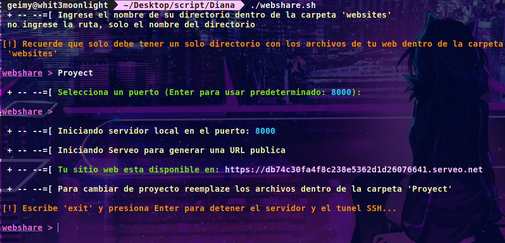

# 🌐 WebShare


> ✨ **WebShare** es un script en Bash que permite compartir tu servidor local de forma rápida y sencilla. Ideal para demostraciones y pruebas en tiempo real.

---

## 🎉 characteristics

- 🚀 **Fácil de usar**: Configuración rápida.
- ⚡ **Ligero y rápido**: Consume pocos recursos del sistema.

- 🌐 **Compartir en cualquier lugar**: Expón tu servidor local a través de una URL pública, Windows Linux Termux

---

## 📋 Requisitos

- 🐚 **Bash** (recomendado [Git Bash](https://gitforwindows.org/))
- 🛠️ **PHP**
- 🔒 **OpenSSH**
    - Instalar OpenSSH Client:
      ```sh
      sudo apt install openssh-client
      ```

---

## 📦 Instalación

1. Clona el repositorio:
    ```sh
    git clone https://github.com/whit3moonlight/WebShare.git
    ```
2. Navega al directorio del proyecto:
    ```sh
    cd WebShare
    ```
3. Da permisos de ejecución al script:
    ```sh
    chmod +x webshare.sh
    ```

---

## 🚀 Uso

1. Crea una carpeta dentro de websites

2. Mueve los archivos de tu web a esa carpeta creada

2. Sigue las instrucciones en pantalla para configurar y lanzar tu servidor.

---

## 📷 Capturas de Pantalla



---


<br>
<p align="center"">

</p>
<p  align="center">
             
<br>

---

⌨️ by [whit3moonlight](https://github.com/whit3moonlight) 😊
